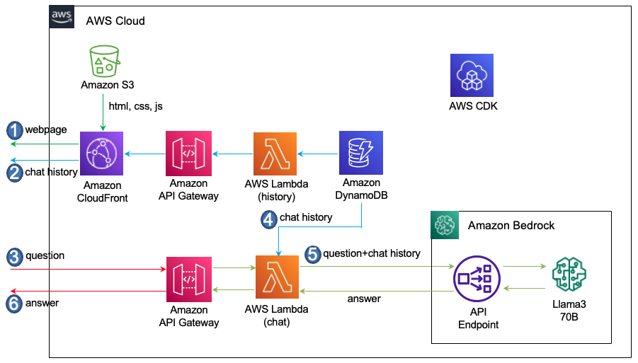

# Llama3 70B와 LangChain으로 한국어 Chatbot 만들기

Llama 70B는 대용량 메모리와 GPU를 필요로 하므로, 한국어 Chatbot 개발 단계부터 직접 설치하여 쓰는것은 부담스러울 수 있습니다. 따라서, 여기에서는 Amazon Bedrock API를 이용해서 Llama3 모델 설치 없이 손쉽게 한국어 Chatbot을 구현하는것을 설명합니다. 또한, LangChain을 이용해 코드 개발 기간을 단축하고 다른 모델에서 사용된 유사 코드를 가능한 수정없이 사용하고자 합니다. 

전체적인 Architecture는 아래와 같으며, 아래와 같이 동작합니다.
1) 사용자는 CloudFront의 도메인으로 접속하면 S3에서 html, js, css 파일들을 읽어와서 브라우저 화면에 채팅창을 구성합니다.
2) 이전 대화를 읽어오기 위하여 '/history' API를 호출합니다. 이때 사용자의 접속 userId를 이용하여 DynamoDB에 저장되어 있는 history를 읽어옵니다.
3) 사용자가 채팅화면에서 질문을 입력하면, WebSocket 방식으로 API Gateway를 통해 요청을 [Lambda-chat](./lambda-chat-ws/lambda_function.py)에 전달합니다.
4) Lambda-chat은 사용자의 request에서 userId를 추출하여, DynamoDB에 있는 대화이력을 가져옵니다.
5) Lambda-chat은 Llama3에 채팅이력(chat history)와 함께 질문을 전달합니다.
6) Llama3의 응답은 API Gateway를 통해 사용자에게 전달됩니다.




## 한국어 Chatbot의 구현

### Llama3 API

여기에서는 LangChain의 [ChatBedrock](https://python.langchain.com/docs/integrations/chat/bedrock/)을 이용해 Llama3 API를 이용합니다. ChatBedrock을 이용하기 위해서 아래와 같이 bedrock-runtime을 위한 boto3_bedrock을 정의하고 LLM Parameter를 지정한 후에 modelId로 "meta.llama3-70b-instruct-v1:0"을 설정합니다.

```python
from langchain_aws import ChatBedrock
bedrock_region = 'us-east-1'
modelId = "meta.llama3-70b-instruct-v1:0"
boto3_bedrock = boto3.client(
    service_name='bedrock-runtime',
    region_name=bedrock_region,
    config=Config(
        retries = {
            'max_attempts': 30
        }            
    )
)

parameters = {
    "max_gen_len": 1024,  
    "top_p": 0.9, 
    "temperature": 0.1,
}    
chat = ChatBedrock(   
    model_id=modelId,
    client=boto3_bedrock, 
    model_kwargs=parameters,
)
```

[error_code.pdf](./contents/error_code.pdf) 파일을 다운로드 한 후에 채팅창의 파일 아이콘을 선택하어 업로드합니다.


### 채팅 이력의 활용

여기에서는 [ConversationBufferWindowMemory](https://api.python.langchain.com/en/latest/memory/langchain.memory.buffer_window.ConversationBufferWindowMemory.html)을 이용하여 대화이력을 저장하기 위한 메모리를 정의합니다. 새로운 대화은 아래와 같이 add_user_message()와 add_ai_message()와 같이 저장합니다.

```python
memory_chain = ConversationBufferWindowMemory(memory_key="chat_history", output_key='answer', return_messages=True, k=10)

memory_chain.chat_memory.add_user_message(text)
memory_chain.chat_memory.add_ai_message(msg)
```

채팅에서 이전 대화이력은 아래와 같이 로드하여 사용합니다. 

```python
history = memory_chain.load_memory_variables({})["chat_history"]
```


## Prompt format

[Meta Llama 3 Instract](https://llama.meta.com/docs/model-cards-and-prompt-formats/meta-llama-3/#special-tokens-used-with-meta-llama-3)에 따라 아래와 같은 prompt format을 가져야 합니다.

- BOS (beginning of a sentence) token: <|begin_of_text|>

- End of the message in a turn: <|eot_id|>

- Role for a particular message (system, user, assistant): <|start_header_id|>{role}<|end_header_id|>

- EOS token: <|end_of_text|>

상기 조건에 맞는 Prompt는 아래와 같습니다.

```text
<|begin_of_text|><|start_header_id|>system<|end_header_id|>

다음은 Human과 AI의 친근한 대화입니다. AI는 상황에 맞는 구체적인 세부 정보를 충분히 제공합니다. 
AI의 이름은 서연이고, Emoji 없이 가능한 한국어로 답변하세요. 또한, 한자는 한국어로 변환합니다.<|eot_id|>
<|start_header_id|>user<|end_header_id|>

{input}<|eot_id|><|start_header_id|>assistant<|end_header_id|>
```

## LangChain의 Chain을 이용한 요청

아래는 일반적인 대화의 응답을 Llama3에 요청하는 함수입니다. Prompt에서는 대화의 형태의 Chatbot의 이름을 지정합니다. 또한 원하는 포맷이나 답변을 지정하는데, 여기에서는 Emoji없는 한국어 답변을 요청하였습니다. 또한, 답변에 한자나 일본어가 있을 경우에 한국어로 변환을 요청합니다. 대화이력을 읽어와서 "history"로 입력하고, 사용자의 입력은 "input"로 invoke시 전달합니다. 이때의 응답에는 사용 토큰에 대한 정보를 아래와 같이 포함하고 있습니다. 


```python
def general_conversation(connectionId, requestId, chat, query):
    system = (
"""<|begin_of_text|><|start_header_id|>system<|end_header_id|>\n
다음은 Human과 AI의 친근한 대화입니다. AI는 상황에 맞는 구체적인 세부 정보를 충분히 제공합니다. 
AI의 이름은 서연이고, Emoji 없이 가능한 한국어로 답변하세요. 또한, 한자는 한국어로 변환합니다.<|eot_id|>"""
    )
    human = """<|start_header_id|>user<|end_header_id|>\n\n{input}<|eot_id|><|start_header_id|>assistant<|end_header_id|>"""
    
    prompt = ChatPromptTemplate.from_messages([("system", system), MessagesPlaceholder(variable_name="history"), ("human", human)])
    print('prompt: ', prompt)
    
    chain = prompt | chat
        
    history = memory_chain.load_memory_variables({})["chat_history"]
    print('memory_chain: ', history)
                
    try: 
        isTyping(connectionId, requestId)  
        stream = chain.invoke(
            {
                "history": history,
                "input": query,
            }
        )
        msg = readStreamMsg(connectionId, requestId, stream.content)
        
        print('stream: ', stream)        
        usage = stream.response_metadata['usage']
        print('prompt_tokens: ', usage['prompt_tokens'])
        print('completion_tokens: ', usage['completion_tokens'])
        print('total_tokens: ', usage['total_tokens'])
        msg = stream.content
        
    except Exception:
        err_msg = traceback.format_exc()
        print('error message: ', err_msg)        
            
        sendErrorMessage(connectionId, requestId, err_msg)    
        raise Exception ("Not able to request to LLM")
    
    return msg
```

LLM의 응답시간은 수초이상이므로 Stream을 사용하여 사용성을 개선합니다. 아래와 같이 inovke의 응답에서 stream 정보를 추출하여 client로 전달합니다.

```python
def readStreamMsg(connectionId, requestId, stream):
    msg = ""
    if stream:
        for event in stream:
            msg = msg + event

            result = {
                'request_id': requestId,
                'msg': msg,
                'status': 'proceeding'
            }
            sendMessage(connectionId, result)
    return msg
```

### AWS CDK로 인프라 구현하기

[CDK 구현 코드](./cdk-korean-chatbot/README.md)에서는 Typescript로 인프라를 정의하는 방법에 대해 상세히 설명하고 있습니다.

## 직접 실습 해보기

### 사전 준비 사항

이 솔루션을 사용하기 위해서는 사전에 아래와 같은 준비가 되어야 합니다.

- [AWS Account 생성](https://repost.aws/ko/knowledge-center/create-and-activate-aws-account)


## 실행결과

채탱창이 열리면 "여행하고 싶다."라고 입력합니다. 아래와 같이 영향의 의미와 대표적인 관광지에 대한 정보를 보여줍니다.


"경주"라고 입력하면, 이전 대화에서 여행에 대해 얘기했으므로, 경주의 여행정보를 아래와 같이 보여줍니다. Llama3는 아직 [multilingual을 공식적으로 지원하지 않고 있어](https://ai.meta.com/blog/meta-llama-3/), 일부 부족한 면이 있으나 어느정도 수준의 한국어를 지원하고 있습니다. 


[error_code.pdf](./contents/error_code.pdf)을 다운로드 한 후에, 채팅창의 파일 아이콘을 선택하여 업로드를 하면 아래와 같이 파일 내용을 요약한 결과를 확인할 수 있습니다.


브라우저에서 뒤로가기를 선택하여 아래와 같이 Conversation Type을 "2. Translation"로 선택합니다. 


"경주는 우리나라의 역사적인 도시입니다. 경주는 신라왕조의 수도였으며, 많은 문화유산을 가지고 있습니다. 경주에는 다양한 관광지가 있습니다. 불국사는 유네스코 세계문화유산으로 지정된 사찰입니다. 이 곳에는 많은 문화재가 있습니다. 둘째, 석굴암은 불국사와 함께 유네스코 세계문화유산으로 지정된 석굴입니다. 이 곳에는 많은 불상이 있습니다. 셋째, 경주歴史公園은 경주의 역사적인 문화유산을 느낄 수 있는 곳입니다. 이 곳에는 안압지, 첨성대, 황룡사지 등이 있습니다. 넷째, 양동마을은 전통한옥마을로 옛날의 모습을 그대로 간직하고 있습니다. 경주에는 역사적인 문화유산이 많아 역사에 관심이 있는 분들에게 추천합니다. 또한, 경주는 자연경관도 아름답습니다. 경주를 방문하여 다양한 경험을 하실 수 있습니다."라고 입력합니다. 이때의 번역 결과는 아래와 같습니다.


다시 뒤로 가기를 선택하여, "3. Grammatical Error Correction"을 선택합니다. 이후 "Gyeongju are a historic city in our country. It were the capital of the Silla Kingdom and have many cultural heritages."로 입력후 결과를 확인합니다. 아래와 같이 잘못된 문법과 수정된 내용을 보여줍니다.


## 리소스 정리하기 

더이상 인프라를 사용하지 않는 경우에 아래처럼 모든 리소스를 삭제할 수 있습니다. 

1) [API Gateway Console](https://ap-northeast-2.console.aws.amazon.com/apigateway/main/apis?region=ap-northeast-2)로 접속하여 "rest-api-for-llama3-70b-langchain", "ws-api-for-llama3-70b-langchain"을 삭제합니다.

2) [Cloud9 console](https://ap-northeast-2.console.aws.amazon.com/cloud9control/home?region=ap-northeast-2#/)에 접속하여 아래의 명령어로 전체 삭제를 합니다.

```text
cd ~/environment/llama3-70b-langchain/cdk-llama3-bedrock/ && cdk destroy --all
```

